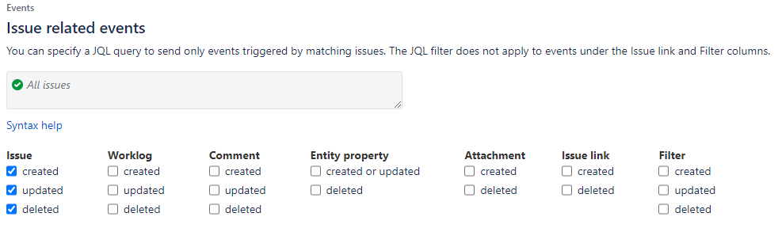
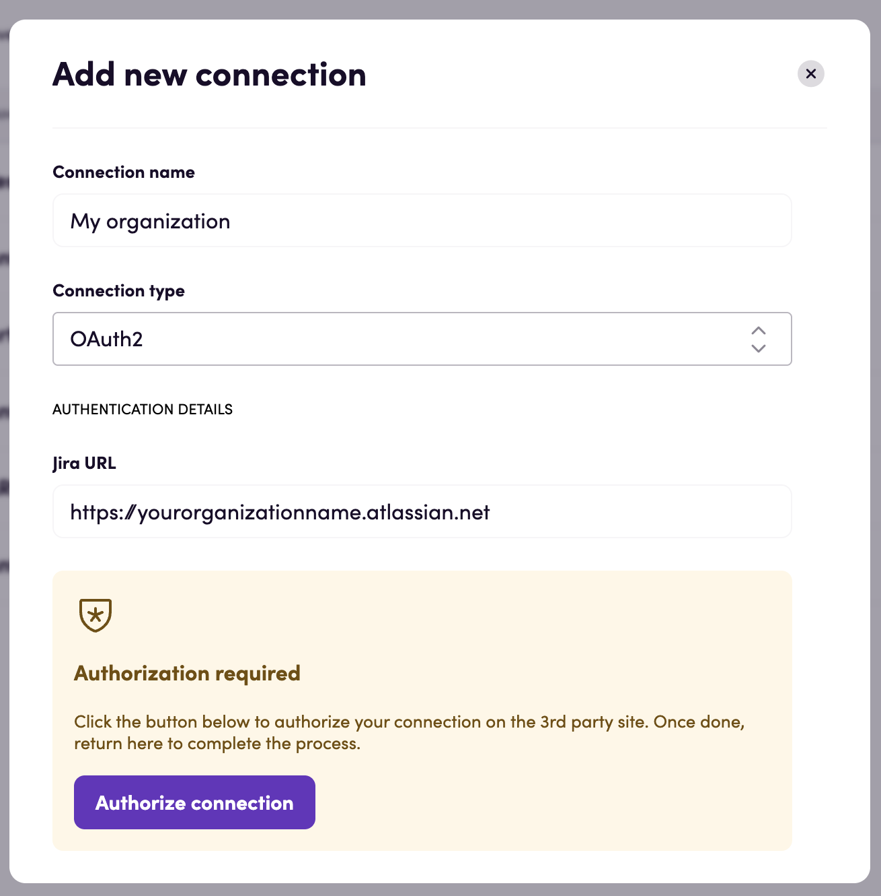
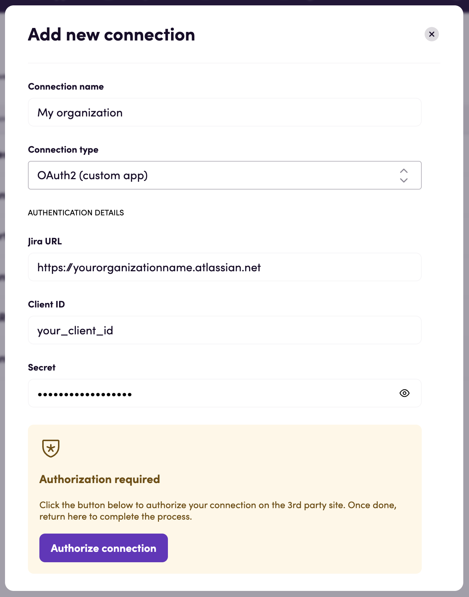
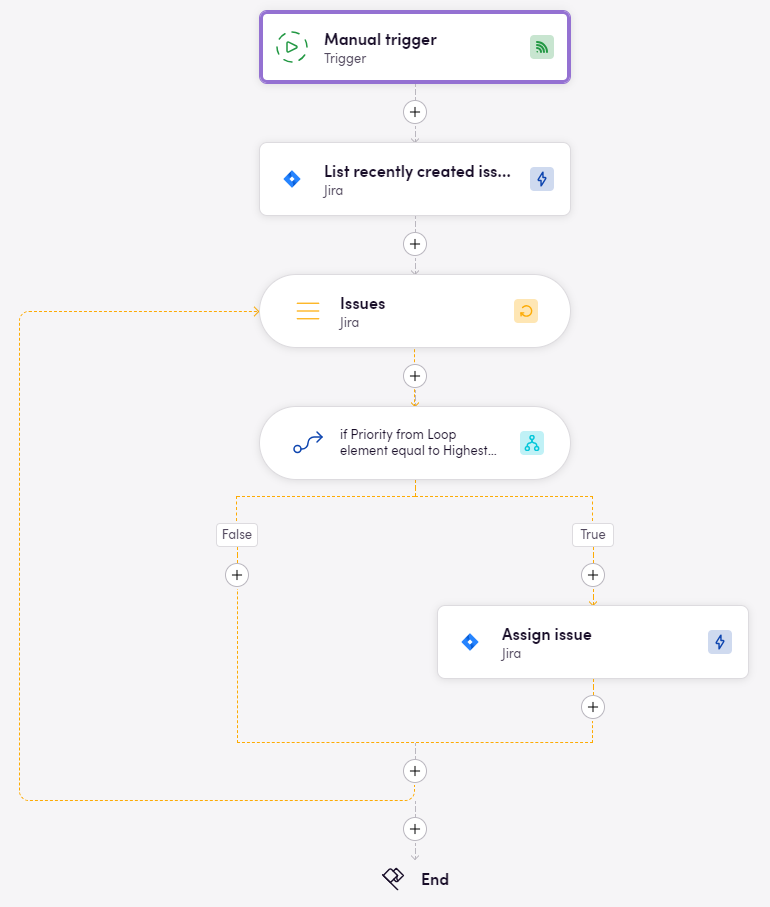
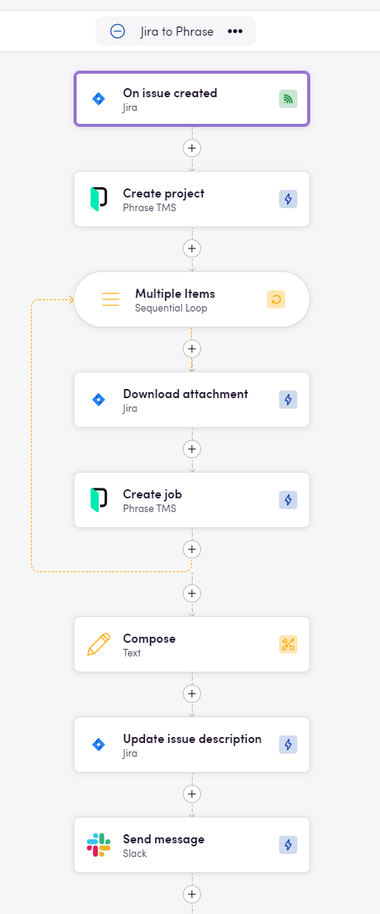

# Blackbird.io Jira

Blackbird is the new automation backbone for the language technology industry. Blackbird provides enterprise-scale automation and orchestration with a simple no-code/low-code platform. Blackbird enables ambitious organizations to identify, vet and automate as many processes as possible. Not just localization workflows, but any business and IT process. This repository represents an application that is deployable on Blackbird and usable inside the workflow editor.

## Introduction

<!-- begin docs -->

Jira is a widely used project management and issue tracking tool developed by Atlassian. It provides teams with a platform to plan, track, and manage tasks, projects, and software development processes, helping to streamline collaboration and improve project visibility. This Jira app primarily focuses on issues management.

## Before setting up

Before you can connect you need to make sure that:

- You have an Atlassian account and [Jira site](https://support.atlassian.com/jira-work-management/docs/set-up-your-site/).
- You have a [project created](https://support.atlassian.com/jira-software-cloud/docs/create-a-new-project/).
- You have the right [permissions](https://support.atlassian.com/jira-cloud-administration/docs/permissions-for-company-managed-projects/#Issue-permissions).

### Custom OAuth2 apps

If you want to use your custom OAuth2 app to connect, you need to:

- Go to [Atlassian Developer Console](https://developer.atlassian.com/console/myapps/).
- Click _Create_ > _OAuth 2.0 Integration_.
- Name your app for future reference, read and agree to be bound by Atlassian's developer terms and click _Create_.
- Go to _Authorization_ and click _Add_ for the OAuth 2.0 (3LO) authorization type.
- In the _Callback URLs_ field, specify `https://bridge.blackbird.io/api/AuthorizationCode` and click _Save changes_.
- Go to _Permissions_ and configure the scopes listed in [Required scopes](#required-scopes) for the actions and events you want to use. Include `offline_access` to allow Blackbird to refresh the OAuth connection.
- Go to _Settings_ > _Authentication details_ and copy `Client ID` and `Secret` values.

### Enable webhooks

If you want to use Jira webhooks, you need to:

- Log in as a user with Administer Jira [global permission](https://support.atlassian.com/jira-cloud-administration/docs/manage-global-permissions/).
- In top right corner choose  > _System_. Under _Advanced_, select _WebHooks_.
- In top right corner choose _Create a WebHook_.
- In _URL_ field specify `https://bridge.blackbird.io/api/webhooks/jira`.
- Make sure that _Status_ is _Enabled_.
- Select everything under _Issue related events_ > _Issue_.
- Scroll to the bottom of the page and click _Create_.



### Adding custom fields

To create custom fields, follow [this guide](https://confluence.atlassian.com/adminjiraserver/adding-custom-fields-1047552713.html). Once the custom fields you need are created, you need to:

- Choose  > _Projects_ in top right corner.
- For the project you are interested in, select  > _Project settings_.
- Select _Issue types_ from the left panel.
- Click on issue type to which you want to add created custom fields.
- Locate _Search all fields_ search bar in the right panel.
- Search for the field you are interested in and drag it to issue's fields.
- Click _Save changes_ button.

Note: this app supports a curated subset of custom field types. See the "Issue custom fields" section below for the currently available actions.

## Connecting

Navigate to apps and search for Jira. Click _Add Connection_ and name it for future reference e.g. 'My organization'.

### OAuth2

1. Select the `OAuth2` connection type from the dropdown.
2. Fill in the base URL to the Jira site you want to connect to. The base URL is of shape `https://<organization name>.atlassian.net`. You can usually copy this part of the URL when you are logged into your Jira instance.
3. Click _Authorize connection_.
4. Follow the instructions that Jira gives you, authorizing Blackbird.io to act on your behalf.
5. When you return to Blackbird, confirm that the connection has appeared and the status is _Connected_.



### OAuth2 (custom app)

1. Select the `OAuth2 (custom app)` connection type from the dropdown.
2. Fill in the base URL to the Jira site you want to connect to. The base URL is of shape `https://<organization name>.atlassian.net`. You can usually copy this part of the URL when you are logged into your Jira instance.
3. Fill in the `Client ID` and `Secret` values you obtained from Atlassian Developer Console.
4. Click _Authorize connection_.
5. Follow the instructions that Jira gives you, authorizing Blackbird.io to act on your behalf.
6. When you return to Blackbird, confirm that the connection has appeared and the status is _Connected_.



### Service account with API token

1. Select the `Service account` connection type from the dropdown.
2. Enter your Jira site's base URL, for example `https://<organization name>.atlassian.net`.
3. Enter the service account email and its API token in the `API key` field.
4. Save the connection and confirm that its status is _Connected_.

Create a scoped API token for the service account in [Atlassian Administration](https://support.atlassian.com/user-management/docs/manage-api-tokens-for-service-accounts/). Give the account Jira app access and the project permissions needed by your workflows. Select the scopes listed in [Required scopes](#required-scopes), including `read:jira-user` for connection validation.

The app resolves the Cloud ID from your Jira URL and sends API requests through Atlassian's gateway using HTTP Basic authentication with the email and API token. No interactive OAuth authorization is required. When the token expires or is revoked, replace the API key in the connection.

## Required scopes

Select the scopes needed by your workflows, keeping `read:jira-user` for connection validation. These requirements use Atlassian's recommended classic scopes where available, plus the specific scopes required for email addresses and Jira Software. Granular alternatives are listed in the linked [Jira platform API reference](https://developer.atlassian.com/cloud/jira/platform/rest/v3/intro/) and [Jira Software API reference](https://developer.atlassian.com/cloud/jira/software/rest/intro/).

| Scope | Required for |
| --- | --- |
| `read:jira-user` | Validate the connection; read users, groups, user columns, and user properties. |
| `read:jira-work` | Read and search issues; read comments, attachments, fields, projects, issue types, statuses, priorities, resolutions, labels, versions, and JQL suggestions. |
| `write:jira-work` | Create, update, delete, assign, link, and transition issues; upload attachments; write/delete comments and user properties. |
| `manage:jira-configuration` | Create/delete users and set/reset user columns. |
| `read:email-address:jira` | Get user email. |
| `read:board-scope:jira-software` | List boards for the board dropdown. Also requires `read:project:jira`. |
| `read:project:jira` | List boards together with `read:board-scope:jira-software`. |
| `read:sprint:jira-software` | Read board sprints for the sprint dropdown and Get relevant sprint for date. |
| `write:sprint:jira-software` | Move issues to sprint. |

Scope list for a service-account API token or custom OAuth app covering all documented endpoints:

```text
read:jira-user read:jira-work write:jira-work manage:jira-configuration read:email-address:jira read:board-scope:jira-software read:project:jira read:sprint:jira-software write:sprint:jira-software
```

For OAuth connections, also request `offline_access` to obtain a refresh token. Service-account API tokens do not require `offline_access`. See [Atlassian's OAuth refresh documentation](https://developer.atlassian.com/cloud/jira/platform/oauth-2-3lo-apps/#how-do-i-get-a-new-access-token--if-my-access-token-expires-or-is-revoked-).

Scopes do not grant Jira permissions. The account must also have the relevant project and global permissions. User creation requires Administer Jira and organization-admin access; user deletion requires site-admin access. The standard OAuth connection uses predefined scopes without `manage:jira-configuration`; use a custom OAuth app or service-account token with that scope for the corresponding actions. See [User API permissions](https://developer.atlassian.com/cloud/jira/platform/rest/v3/api-group-users/).

## Actions

Please note: sending too many parallel requests to Jira may result in request rejections. While we have added a retry policy to handle this, ultimate control lies with Jira’s servers.

### Issues

- **Get issue** Get issue details, including the summary, description, status, priority, assignee, and project.

- **Search issues** Search for issues in a project using the supplied filters and optional custom JQL conditions, and output the matching issues and their count. Outputs one page of matching issues.

    Advanced settings:

  - **Created hours ago**: Filter to issues created within this number of hours. Leaving this empty applies no creation-time filter.
  - **Labels**: Select multiple labels; an issue must have at least one selected label.
  - **Fix versions**: Select multiple fix versions; an issue must match at least one selected version.
  - **Parent issue**: Filter to issues with this parent issue.
  - **Custom JQL conditions**: Add JQL conditions to the other filters.

- **List attachments** Search for files attached to an issue and output their details.

- **Download attachment** Download the selected attachment and output a file.

- **Create issue** Create an issue in the selected project and output its ID, key, project details, and issue type.

    Advanced settings:

  - **Description**: Text for the new issue description.
  - **Assignee account ID**: Account ID of the user to assign the issue to.
  - **Due date**: Date the issue is due.
  - **Original estimate**: Original estimated time, supplied as Text in minutes.
  - **Reporter ID**: Account ID of the reporter.
  - **Parent issue key**: Key of the parent issue.

- **Add attachment** Attach a file to an issue and output the attachment details.

- **Update issue** Update only the supplied issue fields. Description supports Markdown, and a status change requires an available workflow transition.

    Advanced settings:

  - **Status (transition) ID**: Target status ID. The status changes only if a transition to it is available.
  - **Issue type ID**: New issue type ID.
  - **Summary**: New issue summary.
  - **Reporter account ID**: Account ID of the new reporter.
  - **Notify users**: Option controlling watcher email notifications for field edits. Disabling notifications requires Administer Jira or Administer project permissions; without them, the request to disable notifications is ignored. Applies when issue fields are edited.
  - **Override screen security**: Option to request edits to fields hidden by screen settings. Applies when issue fields are edited.

- **Append to issue description** Add text as a new paragraph at the end of an issue description, preserving existing formatting and supporting optional formatting for the added text.

    Advanced settings:

  - **Formatting**: Formatting to apply to the added text.

- **Delete issue** Delete an issue. Enable the optional Delete subtasks setting to delete its subtasks as well.

    Advanced settings:

  - **Delete subtasks**: Enable this option to delete the issue and its subtasks. Disabled by default.

- **Add labels to issue** Add labels to an issue while keeping its existing labels, and output the updated issue.

- **Move issues to sprint** Move the selected issues to a sprint, with optional ranking settings, and output whether the move succeeded and a message.

    Advanced settings:

  - **Rank after issue**: Issue key to rank the moved issues after.
  - **Rank before issue**: Issue key to rank the moved issues before.
  - **Rank custom field**: Numeric ID of the custom field used for ranking.

- **Find issue** Search for the first issue matching the supplied filters and optional custom JQL conditions. Output the issue if a match is found. The Parent issue filter also matches Epic Link.

- **Link issue** Link two issues using the selected relationship type, with an optional comment.

    Advanced settings:

  - **Comment**: Text to add as a comment when linking the issues.

- **Clone issue** Create a new issue in the same project with the same issue type, copy supported fields, link it to the source as a clone, and output the new issue. Copies supported custom fields that can be set on creation. Attachments, comments, time tracking, and issue history are excluded. The link is always Cloners; Link type, Comment, and New description are currently ignored.

    Advanced settings:

  - **Copy status**: Enable this option to attempt to match the source status. The status changes only if a transition is available.
  - **New summary**: Summary for the clone; defaults to the source summary.
  - **New description**: Currently ignored; the source description is copied when supported.
  - **Assignee account name**: Account ID for the clone assignee. Defaults to the source assignee if active.
  - **Reporter name**: Account ID for the clone reporter. Defaults to the active source reporter, or the connected user.

- **Get issue type details** Get the details of an issue type by name for the selected project. Output the issue type if a match is found.

### Custom fields

- **Get custom text field value** Get the Text value of a custom field for the selected issue. Supports plain text and URL fields.

- **Set custom text field value** Set the Text value of a custom field for the selected issue.

- **Get custom dropdown field value** Get the selected value of a custom dropdown field for the selected issue.

- **Set custom dropdown field value** Set the selected value of a custom dropdown field for the selected issue.

- **Get custom cascading field value** Get the selected parent and child values and option IDs of a custom cascading field for the selected issue.

- **Set custom cascading field value** Set the parent and optional child option of a custom cascading field for the selected issue. Select the project and issue type that contain the field.

    Advanced settings:

  - **Child option ID**: Child option under the selected parent. Leave empty to set only the parent.

- **Get custom date field value** Get the date value of a custom field for the selected issue.

- **Set custom date field value** Set the date or date and time value of a custom field for the selected issue.

- **Get custom multiselect field values** Get the selected values of a custom field with multiple selection options for the selected issue.

- **Get custom number field value** Get the value of a custom number field for the selected issue and output it as Text.

- **Set custom number field value** Set the value of a custom number field for the selected issue.

- **Set custom rich text field value** Set the Text of a custom rich text field with optional formatting. Link formatting requires a Link URL.

    Advanced settings:

  - **Marks**: Multiple formatting options to apply to the Text.
  - **Link URL**: URL required when link formatting is selected.

- **Set custom multiselect field value** Replace the selected values of a custom field with multiple selection options for the selected issue.

- **Get custom multicheckbox field values** Get the selected values of a custom field with multiple checkboxes for the selected issue.

- **Set custom multicheckbox field values** Replace the selected values of a custom field with multiple checkboxes for the selected issue.

- **Get custom user picker field values** Get the account IDs selected in a custom user picker field for the selected issue.

- **Set custom user picker field values** Replace the users selected in a custom user picker field using their account IDs.

- **Set resolution** Set an issue resolution through an available workflow transition that allows the selected resolution.

### Users

- **List users** Search for users and output up to 20 users.

- **Get user** Get the details of a user by account ID.

- **Delete user** Delete the selected user. This action is irreversible.

- **Create user** Create a user with the supplied email address, optional product access and additional properties, and output the user details.

    Advanced settings:

  - **Products**: Multiple product keys granting product access.
  - **AdditionalPropertiesKeys**: Multiple additional property keys, paired with values in the same order.
  - **AdditionalPropertiesValues**: Multiple additional property values. Supply the same number of values as keys.

- **Get groups** Get the groups associated with the selected user.

- **Get user email** Get the email address of the selected user.

- **Get user columns** Get the issue search columns configured for the selected user.

- **Reset user default columns** Reset the selected user's issue search columns to the default configuration.

- **Set user columns** Set the issue search columns for the selected user.

- **Bulk get users** Get user details for multiple account IDs.

- **Find user by email** Search for a user with an exact email address match, ignoring capitalization. Output the user if a match is found.

### Comments

- **Get issue comments** Get comments for an issue or selected comment IDs, with optional sorting and a limit. Output each comment with its plain text. Outputs one page when fetching comments by issue.

    Advanced settings:

  - **Issue comment IDs**: Multiple comment IDs to fetch instead of comments from the selected issue.
  - **Limit**: Maximum number of comments to output; must be greater than zero.
  - **Sort**: Order by creation date: Newest to oldest or Oldest to newest.

- **Get issue comment** Get the selected issue comment and output its details and plain text.

- **Delete issue comment** Delete the selected comment from an issue.

- **Add issue comment** Add a comment containing Text, a link, or user mentions, and output its details and plain text. Supply at least one of these inputs.

    Advanced settings:

  - **Text**: Comment text. Supply Text, a Link URL, or Mention users.
  - **Link text**: Text displayed for the link; requires a Link URL. Defaults to the URL.
  - **Mention users**: Multiple users to mention in a separate paragraph.

- **Append text to comment** Replace the selected comment body with the supplied Text, link, or user mentions, and output its details and plain text. Supply at least one of these inputs. Despite its name, this action replaces the existing body.

- **Find issue comment by text** Find a comment containing the supplied text, ignoring capitalization. Output the first match or, when Latest is enabled, the most recently updated match, with its plain text. Searches one page of comments.

    Advanced settings:

  - **Latest**: Enable this option to select the most recently updated match, using creation date if the update date is unavailable. Disabled by default.

### Sprints

- **Get relevant sprint for date** Get all sprints on the selected board whose start and end dates include the supplied date, and output the sprints and a message.

### User properties

- **Get user properties** Get the keys of the properties stored for the selected user.

- **Get boolean user property** Get the true or false value of a property for the selected user.

- **Get string user property** Get the Text value of a property for the selected user.

- **Get integer user property** Get the whole number value of a property for the selected user.

- **Get date user property** Get the date value of a property for the selected user.

- **Get array user property** Get multiple Text values stored in a property for the selected user.

- **Set user property** Set a property for the selected user. Supply exactly one value input: an option, Text, a whole number, a date, or multiple Text values.

    Advanced settings:

  - **Boolean value**: True or false option.
  - **Text value**: Text value.
  - **Integer value**: Whole number value.
  - **Date value**: Date value.
  - **Array value**: Multiple Text values.

- **Delete user property** Delete the selected property from a user.

## Events

### Issues

- **On issue updated** Start when an issue is updated, with optional filters for the issue, projects, changed fields, labels, and custom JQL conditions.

    Advanced settings:

  - **Issue**: Only start for this issue.
  - **Projects**: Only start for issues in the selected projects.
  - **Fields**: Only start when at least one selected field changes.
  - **Labels (manual)**: Manually enter multiple required labels. The issue must have all supplied labels.
  - **Labels (dropdown selection)**: Select multiple required labels. The issue must have all supplied labels, including any entered manually.

- **On issue created** Start when an issue is created, with optional filters for projects, labels, parent issues, and custom JQL conditions.

    Advanced settings:

  - **Parent issue key(s)**: Only start for issues whose parent matches one of these keys.

- **On issue assigned** Start when an issue is assigned to the selected user, with optional project and label filters.

- **On issue with specific type created** Start when an issue is created with the selected type or its type changes to the selected type, with optional project and label filters.

- **On issue with specific priority created** Start when an issue is created or updated with an assignment to the selected priority, with optional project and label filters.

- **On issue deleted** Start when an issue is deleted, with optional project and label filters.

- **On file attached to issue** Start when a file is attached to an issue and output the attachment details, with optional issue and project filters.

- **On issue status changed** Start when an issue changes status, with filters for the project and optional issue, target status, labels, issue type, and summary.

- **On issues reach status** Start when a selected issue is updated and all specified issues are in one of the selected statuses. Output the specified issues; they can span multiple projects. Each issue may match a different selected status.

- **On issues reach status (polling)** Start when all specified issues in the selected project are in one of the selected statuses, and output the issues. Can start again while this condition remains true. Each issue may match a different selected status.

## Optional inputs

We may provide two options for inputting one property to filter results:

1. **Manual** (particularly useful when dealing with a large number of labels, which could otherwise lead to performance issues when retrieving values from the API):
    - **Description**: Allows the user to manually enter value without the assistance of a dropdown list.
    - **Use Case**: This option is ideal when the user knows the exact value they want to use or when the dropdown may not be effective due to the large number of values available through the API.

2. **Dropdown selection**:
    - **Description**: Allows the user to select a value from a dropdown list.
    - **Use Case**: This option is suitable when there are fewer labels, making it convenient for users to select from a predefined list. However, this approach can be less effective if the number of labels is very large, potentially leading to timeout errors during data retrieval.

## Example



This example bird fetches newest issues and assigns those with highest priority to a specific assignee.



This example shows how to create new TMS (Phrase) projects from issues.

## Missing features

In the future we can add actions for:

- Projects
- Dashboards

Let us know if you're interested!

<!-- end docs -->
