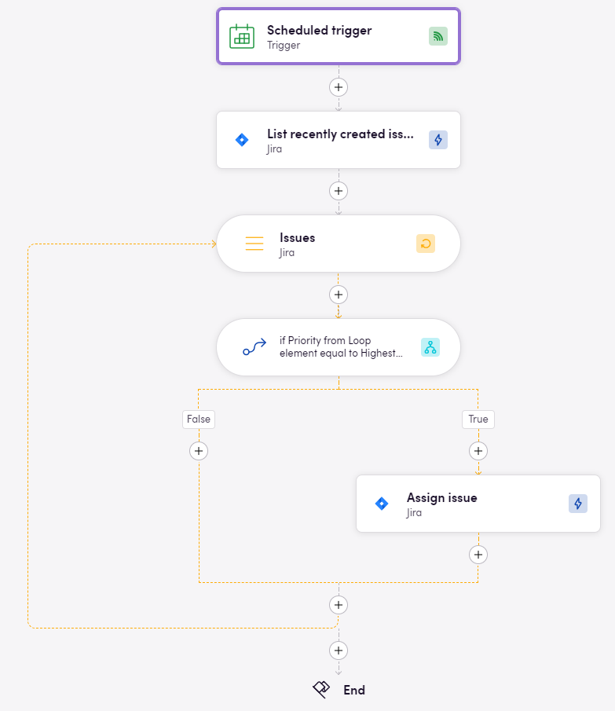

# Blackbird.io Jira

Blackbird is the new automation backbone for the language technology industry. Blackbird provides enterprise-scale automation and orchestration with a simple no-code/low-code platform. Blackbird enables ambitious organizations to identify, vet and automate as many processes as possible. Not just localization workflows, but any business and IT process. This repository represents an application that is deployable on Blackbird and usable inside the workflow editor.

## Introduction

<!-- begin docs -->

Jira is a widely used project management and issue tracking tool developed by Atlassian. It provides teams with a platform to plan, track, and manage tasks, projects, and software development processes, helping to streamline collaboration and improve project visibility. This Jira app primarily focuses on issues management.

## Before setting up

Before you can connect you need to make sure that:

- You have an Atlassian account and [Jira site](https://support.atlassian.com/jira-work-management/docs/set-up-your-site/).
- You have a [project created](https://support.atlassian.com/jira-software-cloud/docs/create-a-new-project/).
- You have the right [permissions](https://support.atlassian.com/jira-cloud-administration/docs/permissions-for-company-managed-projects/#Issue-permissions).

### Enable webhooks

If you want to use Jira webhooks, you need to:

- Log in as a user with Administer Jira [global permission](https://support.atlassian.com/jira-cloud-administration/docs/manage-global-permissions/).
- In top right corner choose  > _System_. Under _Advanced_, select _WebHooks_.
- In top right corner choose _Create a WebHook_.
- In _URL_ field specify `https://bridge.blackbird.io/api/webhooks/jira`.
- Make sure that _Status_ is _Enabled_.
- Select everything under _Issue related events_ > _Issue_.
- Scroll to the bottom of the page and click _Create_.

### Adding custom fields

To create custom fields, follow [this guide](https://confluence.atlassian.com/adminjiraserver/adding-custom-fields-1047552713.html). Once the custom fields you need are created, you need to:

- Choose  > _Projects_ in top right corner.
- For the project you are interested in, select  > _Project settings_.
- Select _Issue types_ from the left panel.
- Click on issue type to which you want to add created custom fields.
- Locate _Search all fields_ search bar in the right panel.
- Search for the field you are interested in and drag it to issue's fields.
- Click _Save changes_ button.

Note: this app currently supports only short text (plain text only) custom fields.

## Connecting

1. Navigate to apps and search for Jira. If you cannot find Jira then click _Add App_ in the top right corner, select Jira and add the app to your Blackbird environment.
2. Click _Add Connection_.
3. Name your connection for future reference e.g. 'My organization'.
4. Fill in the base URL to the Jira site you want to connect to. The base URL is of shape `https://<organization name>.atlassian.net`. You can usually copy this part of the URL when you are logged into your Jira instance.
5. Click _Authorize connection_.
6. Follow the instructions that Jira gives you, authorizing Blackbird.io to act on your behalf.
7. When you return to Blackbird, confirm that the connection has appeared and the status is _Connected_.

## Actions

### Issues

- **Get issue** returns the details for an issue (summary, description, status, priority, assignee, project).
- **List recently created issues** returns issues created during past hours in a specific project.
- **Get issue transitions** returns either all transitions or a transition that can be performed by the user on an issue. Transition can also be thought of as status (e.g. To Do/In Progress/Done).
- **List attachments** returns a list of files attached to an issue.
- **Download attachment** returns the contents of an attachment.
- **Get value of custom string field** returns the value of custom string field of specific issue. If value is not set, empty value is returned.
- **Transition issue** performs an issue transition.
- **Create issue**.
- **Add attachment** adds attachment to an issue.
- **Assign issue**.
- **Update issue summary**.
- **Update issue description**.
- **Prioritize issue** sets priority for an issue (e.g. High/Medium/Low).
- **Set value of custom string field** sets the value of custom string field of specific issue. 
- **Delete issue**.

### Users

- **Get all users**.

## Events

- **On issue updated** is triggered when an issue is updated. If you want a bird to be triggered when specific issue is updated, specify the issue parameter. Otherwise, you can specify project parameter if you are interested in specific project's issues. 
- **On issue created** is triggered when an issue is created. If you want a bird to be triggered when an issue is created in specific project, fill the project parameter. 
- **On issue assigned** is triggered when an issue is assigned to specific user. You can specify project parameter if you're interested in specific project.
- **On issue with specific type created** is triggered when an issue created has specific type (for example, a bug) or an existing issue was updated to have specific type. Optionally, you can specify project parameter. 
- **On issue with specific priority created** is triggered when an issue created has the specified priority or an existing issue was updated to have the specified priority.
- **On issue deleted** is triggered when an issue is deleted. If you want a bird to be triggered when an issue is deleted in specific project, fill the project parameter.
- **On file attached to issue** is triggered when a file is attached to an issue. If you want a bird to be triggered when a file is attached to specific issue, specify the issue parameter. Otherwise, you can specify project parameter if you are interested in specific project's issues.
- **On issue status changed** is triggered when issue status is changed. If you want a bird to be triggered when specific issue's status is changed, specify the issue parameter. Otherwise, you can specify project parameter if you are interested in specific project's issues.

## Example

This example bird fetches newest issues and assigns those with highest priority to a specific assignee.

## Missing features

In the future we can add actions for:

- Different custom fields 
- Projects
- Users
- Issue comments
- Dashboards

Let us know if you're interested!

<!-- end docs -->
