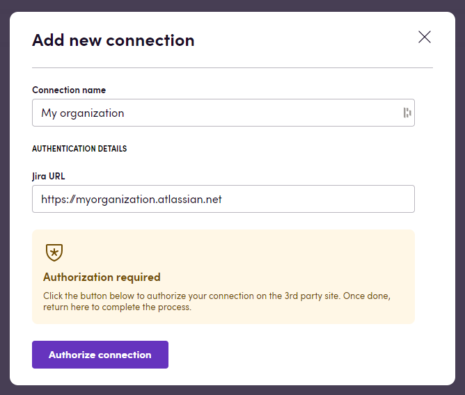

# Blackbird.io Jira

Blackbird is the new automation backbone for the language technology industry. Blackbird provides enterprise-scale automation and orchestration with a simple no-code/low-code platform. Blackbird enables ambitious organizations to identify, vet and automate as many processes as possible. Not just localization workflows, but any business and IT process. This repository represents an application that is deployable on Blackbird and usable inside the workflow editor.

## Introduction

Jira is a widely used project management and issue tracking tool developed by Atlassian. It provides teams with a platform to plan, track, and manage tasks, projects, and software development processes, helping to streamline collaboration and improve project visibility. This Jira app primarily focuses on issues management.

## Before setting up

Before you can connect you need to make sure that:

- You have an Atlassian account and [Jira site](https://support.atlassian.com/jira-work-management/docs/set-up-your-site/).
- You have a [project created](https://support.atlassian.com/jira-software-cloud/docs/create-a-new-project/).
- You have the right [permissions](https://support.atlassian.com/jira-cloud-administration/docs/permissions-for-company-managed-projects/#Issue-permissions).

## Connecting

1. Navigate to apps and search for Jira. If you cannot find Jira then click _Add App_ in the top right corner, select Jira and add the app to your Blackbird environment.
2. Click _Add Connection_.
3. Name your connection for future reference e.g. 'My organization'.
4. Fill in the base URL to the Jira site you want to connect to. The base URL is of shape `https://<organization name>.atlassian.net`. You can usually copy this part of the URL when you are logged into your Jira instance.
5. Click _Authorize connection_.
6. Follow the instructions that Jira gives you, authorizing Blackbird.io to act on your behalf.
7. When you return to Blackbird, confirm that the connection has appeared and the status is _Connected_.

## Actions

### Issues

- **Get issue** returns the details for an issue (summary, description, status, priority, assignee, project).
- **List recently created issues** returns issues created during past hours in a specific project.
- **Get issue transitions** returns either all transitions or a transition that can be performed by the user on an issue. Transition can also be thought of as status (e.g. To Do/In Progress/Done).
- **List attachments** returns a list of files attached to an issue.
- **Download attachment** returns the contents of an attachment. 
- **Transition issue** performs an issue transition.
- **Create issue**.
- **Add attachment** adds attachment to an issue.
- **Assign issue**.
- **Update issue summary**.
- **Update issue description**.
- **Prioritize issue** sets priority for an issue (e.g. High/Medium/Low).
- **Delete issue**.

### Users

- **Get all users**.

## Example

This example bird fetches newest issues and assigns those with highest priority to a specific assignee.

## Missing features

In the future we can add actions for:

- Projects
- Users
- Issue comments
- Dashboards

Let us know if you're interested!
